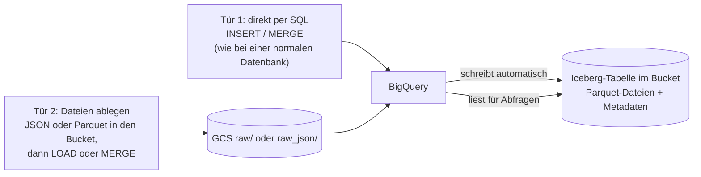
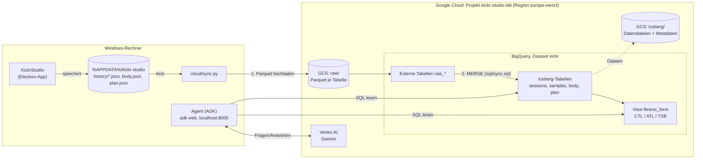
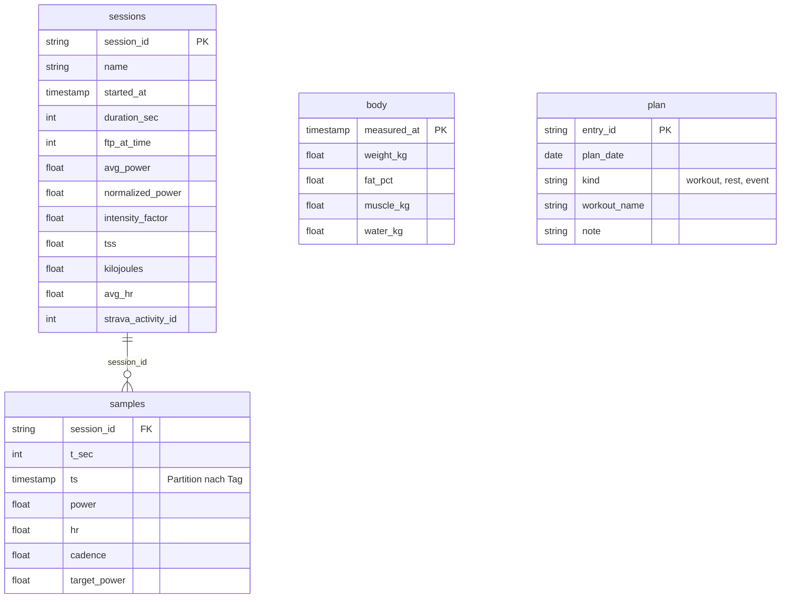
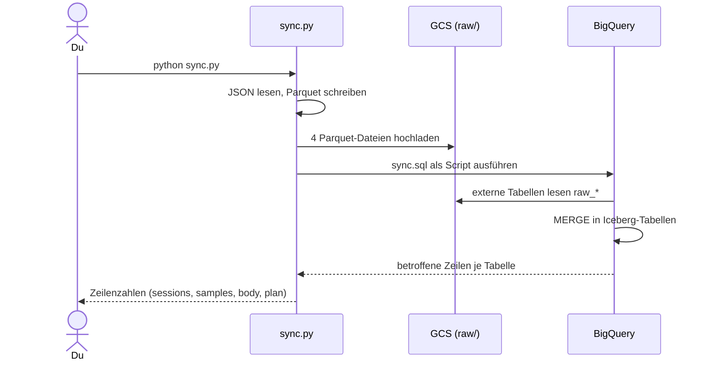
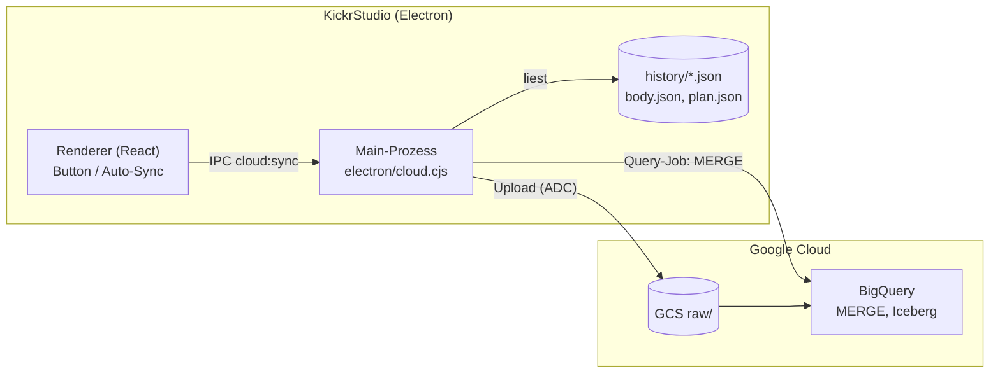
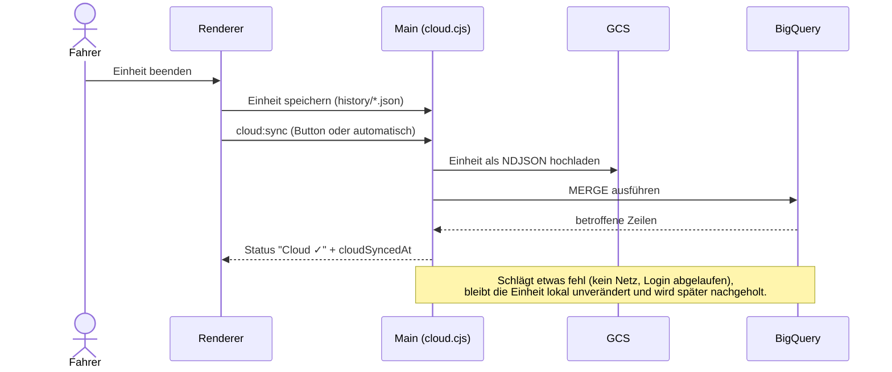
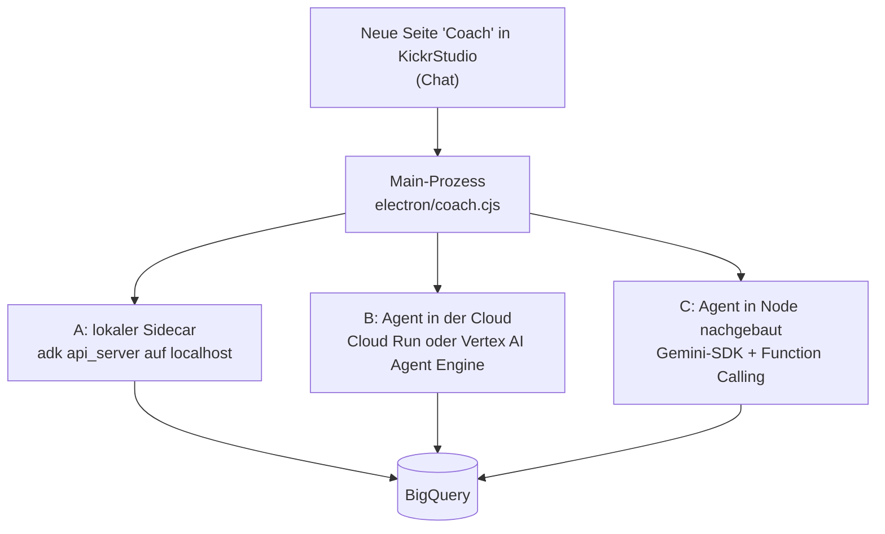
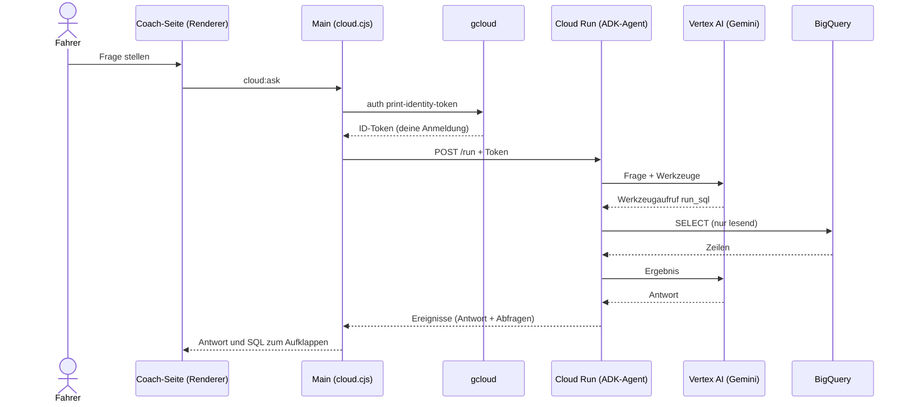
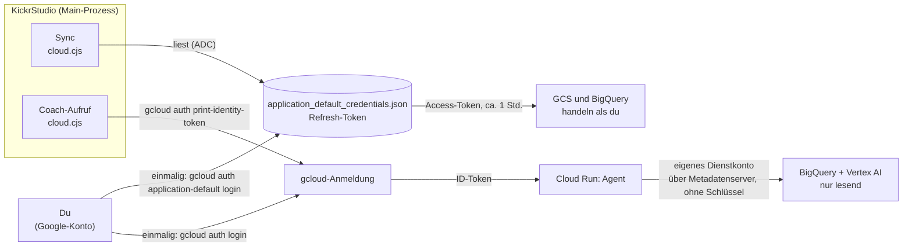

# Cloud-Architektur: Trainingsdaten in Google Cloud (Iceberg, BigQuery, Agent)

Ziel: Die Trainingsdaten aus KickrStudio fließen nach jeder Einheit in die Google Cloud,
liegen dort als **Apache-Iceberg-Tabellen** (Parquet in GCS), sind mit **BigQuery** auswertbar
und werden von einem **KI-Agenten (Google ADK + Gemini)** befragt. Nebenziel: Google Cloud
in der Praxis lernen.

**Status:** Phase 0 (manueller Ablauf) ist getestet. Phase 1/2 (Cloud-Sync in der App) und die
Coach-Seite sind gebaut; der Agent wird in die Cloud (Cloud Run) deployt (Weg B). Die
App-Anbindung an die echte Cloud ist erst nach dem ersten Release-Test bestätigt.

## 1. Die Bausteine in einem Satz

| Baustein | Was es ist | Rolle hier |
|---|---|---|
| **GCS-Bucket** | Objektspeicher (wie ein Dateiserver) | Liegt unter allem: Rohdaten und Iceberg-Dateien |
| **Parquet** | Spaltenorientiertes Dateiformat | Format der Rohdaten und der Datendateien in Iceberg |
| **Apache Iceberg** | Tabellenformat *über* Parquet-Dateien (Metadaten, Snapshots, Schema-Evolution, Partitionen) | Macht aus einem Ordner voller Dateien echte Tabellen mit `MERGE`, Zeitreise und Versionsverlauf |
| **BigQuery** | Serverloses SQL-Data-Warehouse | Schreibt/verwaltet die Iceberg-Tabellen und beantwortet SQL |
| **Verbindung (`iceberg-conn`)** | Dienstkonto, mit dem BigQuery in den Bucket schreibt | Erklärt, warum der Bucket eine Rechtevergabe braucht |
| **Vertex AI / Gemini** | Modell-Plattform von Google | Das Sprachmodell des Agenten |
| **ADK (Agent Development Kit)** | Python-Framework für Agenten | Verbindet Gemini mit Werkzeugen (SQL gegen BigQuery) |

Merksatz: **Parquet** sind die Dateien, **Iceberg** macht daraus Tabellen, **BigQuery** ist der
Motor, der sie liest und schreibt, der **Agent** ist eine Chat-Oberfläche darüber.

### Wie fühlt sich das an: Datenbank oder Dateien?

**Beides.** Nach außen ist es eine ganz normale Datenbank, nach innen sind es Dateien.

- **Es gibt einen Node-Connector**, `@google-cloud/bigquery`, und er funktioniert wie `pg` oder `mysql2`:
  `bigquery.query("SELECT ...")` oder `INSERT` / `MERGE`. In der BigQuery-Konsole siehst du die Tabellen
  und fragst sie mit SQL ab, genau wie bei einer klassischen Datenbank.
- **Darunter liegen Dateien:** Jede Tabelle besteht im Bucket aus Parquet-Dateien plus
  Iceberg-Metadaten (das „Inhaltsverzeichnis": welche Dateien gehören in welcher Version zur Tabelle).
  **Du erzeugst Parquet und Metadaten nie selbst.** BigQuery schreibt sie, sobald du Daten einfügst.
- **Zwei Türen zur selben Tabelle:**



**Warum nutzt die App Tür 2?** Sie lädt die Einheit als eine JSON-Datei in den Bucket und lässt BigQuery per
`MERGE` daraus die Tabellen befüllen. Eine Einheit hat rund 3.300 Messwert-Zeilen. Zeile für Zeile per
`INSERT` wäre langsam und liefe in Limits für Tabellenänderungen. Ein Batch aus einer Datei ist ein einziger
Auftrag. Außerdem bleibt die Rohdatei als Kopie erhalten: Man kann die Tabellen jederzeit daraus neu
aufbauen, und der Abgleich ist wiederholbar, ohne Duplikate zu erzeugen.

Faustregel: **Wenige, kleine Änderungen direkt per SQL (Tür 1), Mengen von Daten als Datei (Tür 2).**

## 2. Ist-Zustand (Phase 0, manuell)

Ein Befehl (`python cloud/sync.py`) schiebt alles in die Cloud. Der Agent läuft lokal per `adk web`.



Dateien dazu: `cloud/export_parquet.py`, `cloud/sync.py`, `cloud/sql/sync.sql`,
`cloud/agent/kickr_agent/agent.py`.

### Warum zuerst Rohdaten (`raw/`) und dann Iceberg?

`raw/` ist eine unveränderte Kopie dessen, was die App liefert. Die Iceberg-Tabellen werden per
`MERGE` daraus abgeleitet. Vorteile: Der Abgleich ist **idempotent** (beliebig oft ausführbar,
keine Duplikate), und bei einem Fehler in der Logik lassen sich die Tabellen aus `raw/` neu bauen.

## 3. Datenmodell



`fitness_form` ist eine **View** (keine Tabelle) auf `sessions`: TSS pro Tag, daraus CTL
(Fitness, ca. 42 Tage), ATL (Ermüdung, ca. 7 Tage) und TSB (Form = CTL minus ATL).

**Bewusst nicht exportiert:** `settings.json`. Sie enthält Strava- und Withings-Zugangsdaten.

## 4. Ablauf heute (manuell)



## 5. Fest in die App eingebaut (Phase 1/2)

Die Daten fließen **wie beim Strava-Upload**: Einheit beenden, und die App schickt sie los.
Umgesetzt in `electron/cloud.cjs` (Sync, Verbindungstest, Coach-Aufruf), im Button „An Cloud senden"
(Zusammenfassung), in den Einstellungen („Google Cloud") und in der Spalte „Cloud" im Verlauf.

| | Strava heute | Cloud (Ziel) |
|---|---|---|
| Auslöser | Button „An Strava senden" (Zusammenfassung / Verlauf) | Button „An Cloud senden" plus optional automatisch nach jeder Einheit |
| Code | `electron/strava.cjs` | neu: `electron/cloud.cjs` |
| Zugang | OAuth-Token in `settings.json` | **Application Default Credentials** (`gcloud auth application-default login`), kein Schlüssel in der App |
| Ziel | Strava-API | GCS-Bucket, danach BigQuery-`MERGE` |
| Status pro Einheit | `stravaActivityId` im Verlauf | `cloudSyncedAt` im Verlauf |





**Entscheidungen und Begründung**

- **Node statt Python in der App:** Die App liefert kein Python mit. `@google-cloud/storage` und
  `@google-cloud/bigquery` nutzen dieselben Application Default Credentials wie die Python-Skripte.
  Die Python-Skripte bleiben als Lern- und Batch-Werkzeug erhalten.
- **NDJSON statt Parquet aus der App:** Node hat keine gleichwertige, verbreitete Parquet-Bibliothek.
  Einfacher: Die App lädt JSON (eine Zeile je Datensatz) hoch, BigQuery liest es über eine externe
  Tabelle und schreibt es ins Iceberg-/Parquet-Format. Die Einheiten werden ohnehin kompakt in einer
  Zeile gespeichert; die verschachtelten `samples` werden per `UNNEST` in SQL aufgelöst.
- **Auslöser:** Button „An Cloud senden" (wie Strava) oder optional automatisch nach jeder Einheit
  (Einstellung „Auto-Sync"). Ein Doppelstart-Schutz (`src/engine/cloudSync.ts`) verhindert zwei parallele Syncs.
- **Was hochgeladen wird:** Nur Einheiten, die noch nicht synchronisiert sind (`cloudSyncedAt` fehlt oder die
  Strava-ID hat sich geändert), plus Körperdaten und Plan als kleine Gesamtdatei. Zielordner im Bucket:
  `raw_json/sessions/`, `raw_json/body/`, `raw_json/plan/`.
- **Release-Skript:** `scripts/package-app.mjs` installiert die Laufzeit-Abhängigkeiten
  (`@google-cloud/bigquery`, `@google-cloud/storage`, rund 22 MB) in das Paket.
- **Einstellungen:** Bereich „Google Cloud" mit Projekt-ID, Region, Bucket, Dataset, Agent-URL,
  Auto-Sync, „Verbindung testen" und „Jetzt synchronisieren".

## 6. Der Agent in der Anwendung

Der ADK-Agent ist Python. Für die App gibt es drei Wege:



| Weg | Vorteil | Nachteil |
|---|---|---|
| **A** Sidecar | Schnell startklar, Code unverändert | App müsste Python mitliefern und den Prozess verwalten |
| **B** Cloud | Sauber getrennt, kein Python in der App, lehrt Deployment, IAM und Aufrufe mit ID-Token | Etwas mehr Cloud-Einrichtung, laufende Kosten (klein) |
| **C** Node | Alles in einer App | Doppelte Pflege neben dem Python-Agenten |

**Entscheidung: Weg B.** Der Agent läuft privat auf Cloud Run mit einem **eigenen Dienstkonto, das nur
lesen darf** (BigQuery Data Viewer + Job User + Vertex AI User). Selbst wenn der Code einen Fehler hätte oder
das Modell einen Schreibbefehl versuchte, würde BigQuery ihn ablehnen. Die einfache Sperre für
Schreibbefehle im Code ist nur die zweite Schutzschicht.



**Anmeldung App → Agent:** Der Cloud-Run-Dienst ist **nicht öffentlich**. Die App holt sich per
`gcloud auth print-identity-token` ein kurzlebiges Token deiner Google-Anmeldung. Dafür muss `gcloud`
installiert und angemeldet sein und dein Konto die Rolle „Cloud Run Invoker" haben (als Projekt-Owner
ist das gegeben). Später ließe sich das durch ein Dienstkonto mit Identitätswechsel ersetzen.

**Bekannte Grenze:** Die Gesprächsverläufe des Agenten liegen im Arbeitsspeicher des Cloud-Run-Containers.
Startet er neu (z.B. nach Leerlauf), beginnt der Agent ohne Kontext; die App legt die Sitzung dann selbst
neu an. Dauerhaft ginge das über einen Session-Service (z.B. Datenbank).

Daneben bleibt der **MCP-Server** für Claude Desktop bestehen. Beide Wege lassen sich vergleichen:
Claude über MCP auf den lokalen Dateien, Gemini über ADK auf BigQuery.

## 7. Roadmap

| Phase | Inhalt | Lernthema | Status |
|---|---|---|---|
| 0 | Projekt, Bucket, Parquet-Export, Iceberg-Tabellen, `MERGE`, Form-View, lokaler Agent | GCP-Grundlagen, Parquet, Iceberg, BigQuery, ADK | ✅ erledigt |
| 1 | `electron/cloud.cjs`, Button „An Cloud senden", `cloudSyncedAt` im Verlauf, Release-Skript | IPC, ADC in Node, Fehlerbehandlung | gebaut, Test in der App steht aus |
| 2 | Einstellungen „Google Cloud", Verbindungstest, Auto-Sync | Robustheit | gebaut, Test in der App steht aus |
| 3 | Iceberg vertiefen: Snapshots, Time Travel, Schema-Evolution, Metadaten im Bucket | Iceberg | offen |
| 4 | Agent mit Lese-Dienstkonto, Deployment auf Cloud Run | IAM, Cloud Run | in Arbeit |
| 5 | Seite „Coach" in der App, angebunden an den Cloud-Agenten | Agent-Einbettung | gebaut, wartet auf Deployment |
| 6 | Offener Katalog: Lakehouse-API (früher BigLake) mit PyIceberg | offene Iceberg-Nutzung | offen |
| 7 | Optional: Terraform für die Infrastruktur, Cloud Scheduler, Logging und Alerts | Betrieb | offen |

## 8. Betrieb, Kosten, Sicherheit

### Authentifizierung: Wer meldet sich wie an?

Es gibt keine Passwörter und keine Schlüsseldateien in der App. Grundlage sind die zwei Logins, die du beim
Einrichten gemacht hast:

| Login (einmalig) | Ergebnis | Genutzt von |
|---|---|---|
| `gcloud auth application-default login` | Datei `%APPDATA%\gcloud\application_default_credentials.json` mit einem Refresh-Token | Programme mit Google-Bibliotheken: KickrStudio (`cloud.cjs`), Python-Skripte, `adk web` |
| `gcloud auth login` | Anmeldung des `gcloud`-Tools | Befehle wie `gcloud storage ls`, `bq`, und der ID-Token für den Coach |



**Ablauf beim Sync:** Die Google-Bibliothek sucht automatisch nach Zugangsdaten: zuerst eine
Umgebungsvariable, dann die ADC-Datei, sonst (in der Cloud) den Metadatenserver. Sie findet die Datei, tauscht
das Refresh-Token gegen ein kurzlebiges Access-Token und ruft die APIs **in deinem Namen** auf. Deshalb muss
man nichts in die App eintragen.

**Wichtig zu wissen:**
- Die ADC-Datei ist wie ein Schlüssel zu deinem Konto (hier: Owner des Projekts). Sie liegt in deinem
  Benutzerprofil, niemals im Repo oder in der App. Nicht weitergeben oder hochladen.
- Läuft die Anmeldung einmal ab (Meldung wie `invalid_grant` oder „Reauthentication"), genügt es, den Login zu
  wiederholen: `gcloud auth application-default login`.
- Der Cloud-Agent nutzt **nicht** deinen Login, sondern sein eigenes Dienstkonto mit reinen Leserechten.
- Später kann die App statt als „du" mit Identitätswechsel als eigenes Dienstkonto laufen (kleinere Rechte).

- **Kosten:** Wenige MB Daten. Es laufen keine Dauerdienste. Ein Budget-Alert (10 €) ist eingerichtet;
  er warnt nur, er stoppt nichts.
- **Zugang:** `gcloud auth application-default login`. Keine Schlüsseldateien im Repo oder in der App.
- **Region:** Bucket, Dataset und Verbindung liegen alle in `europe-west3`. Das muss so bleiben,
  sonst schlagen Abfragen fehl.
- **Nicht exportiert:** Zugangsdaten aus `settings.json`.
- **Abfrage-Kostenbremse:** Der Agent bricht Abfragen über ca. 100 MB ab (`maximum_bytes_billed`).

## 9. Befehle

```powershell
# einmalig (in cloud/)
python -m venv .venv
.venv\Scripts\Activate.ps1
pip install -r requirements.txt

# nach einer Einheit: alles in die Cloud
python sync.py

# Agent lokal ausprobieren
cd agent
adk web
```

## 10. Dateiübersicht

```
electron/cloud.cjs      Cloud-Sync (GCS + BigQuery-MERGE) und Coach-Aufruf in der App
src/pages/CoachPage.tsx Chat-Seite
src/engine/cloudSync.ts Sync mit Doppelstart-Schutz
cloud/
  export_parquet.py     JSON -> Parquet (+ Upload nach GCS)
  sync.py               Export + Upload + MERGE in einem Befehl
  sql/sync.sql          externe Tabellen + MERGE (idempotent)
  requirements.txt
  agent/kickr_agent/    ADK-Agent (agent.py, .env)
docs/
  cloud-architecture.md dieses Dokument
```
